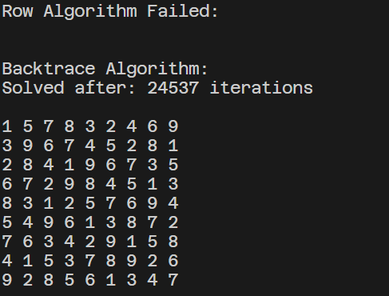

# Sudoku

A Sudoku puzzle solver. Designed with a custom solver that can complete easy to hard problems. Now with backtrace algorithm for expert and beyond.

Easy - 100 iterations  
Hard - 5000 iterations  
Expert - 25000 iterations  

Future:
- ~~Implement a stronger algorithm~~
- Make a visual board
- Take puzzle input  

--  
   
 
